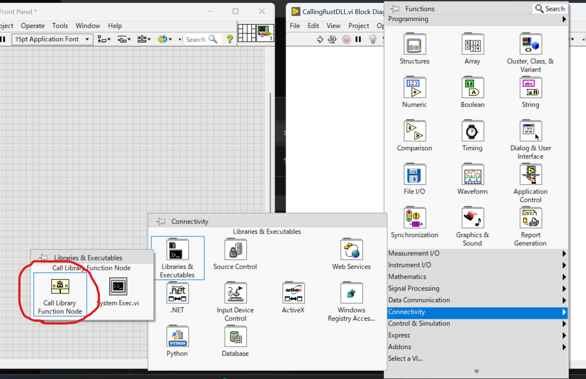
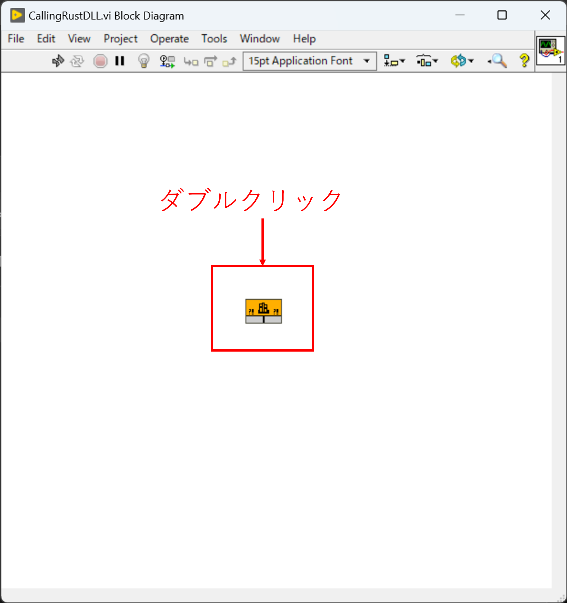
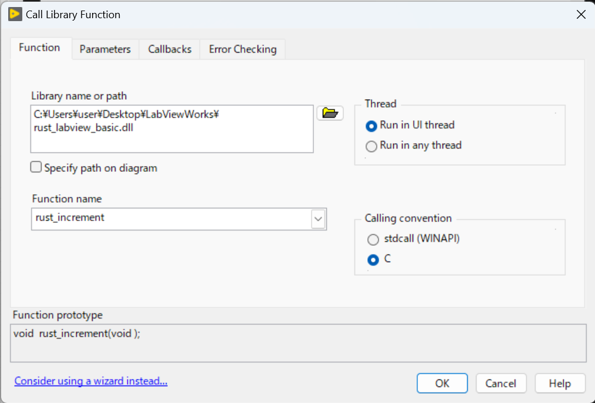
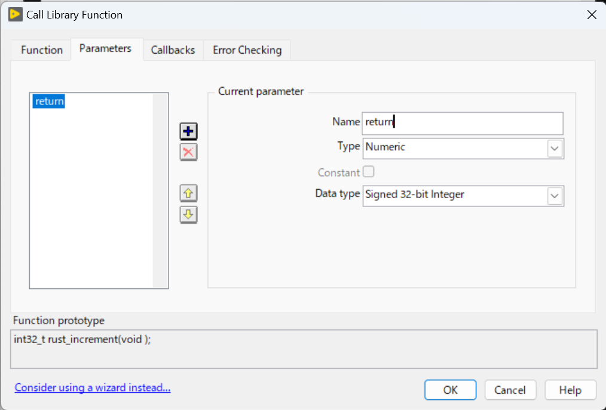
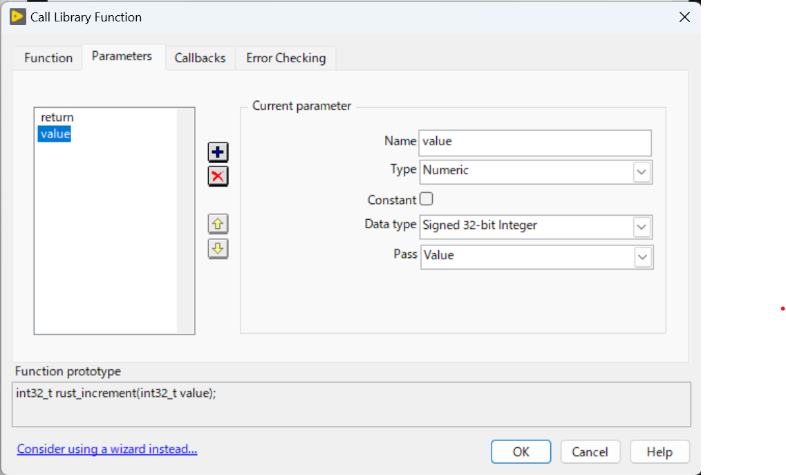
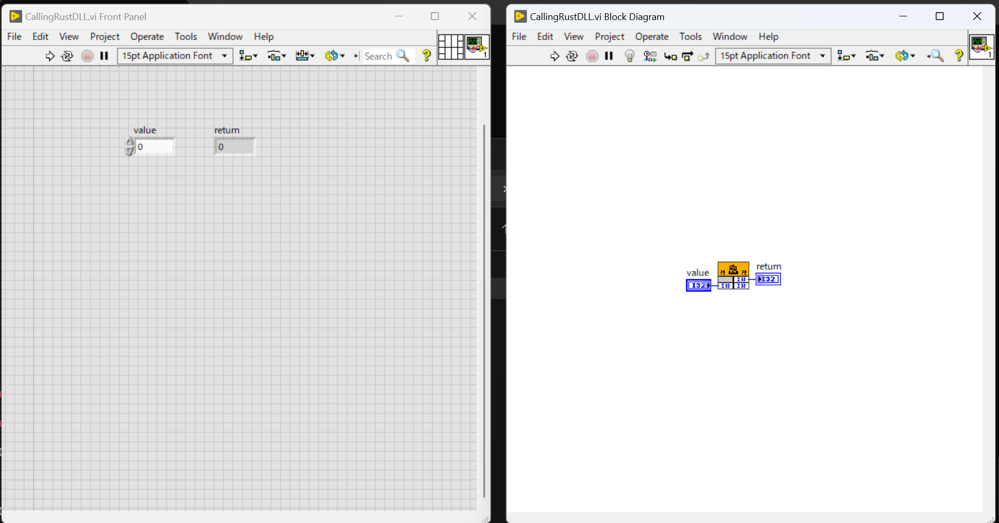

# LabVIEWからRust製dllを呼ぶ
## 前提
- `LabVIEW`は`32bit`版を用いているので、dllも32bit版を作成すること.
- C版のdllとして呼び出すこと（`extern "C" { }`なので） 

## 手順
### [1] dllの作成
```bash
# src/lib.rsを実装
# build.rsを配置して、ビルド時にそれを実行するようcargo.tomlに記載
# →C用のヘッダーファイルを作る

# 32bit版のdll作成に必要
rustup target add i686-pc-windows-msvc
# i686-pc-windows-msvcというフォルダにdllができる
cargo build --target i686-pc-windows-msvc
# target\i686-pc-windows-msvc\debug配下にdllができる
# このdllをLabVIEWプログラムがあるフォルダにコピーする
```

### [2] LabVIEWからの呼び出し
1. dll呼び出し用関数の選択


2. 配置した関数をダブルクリック


3. dllファイルの読み込み


4. dllの返り値の型を合わせる


5. dllの引数の型を合わせる


6. 実行する


